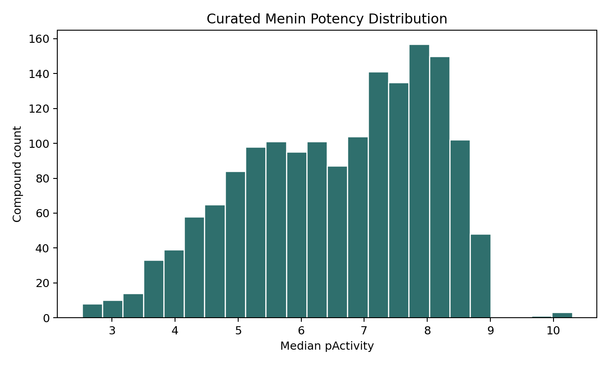
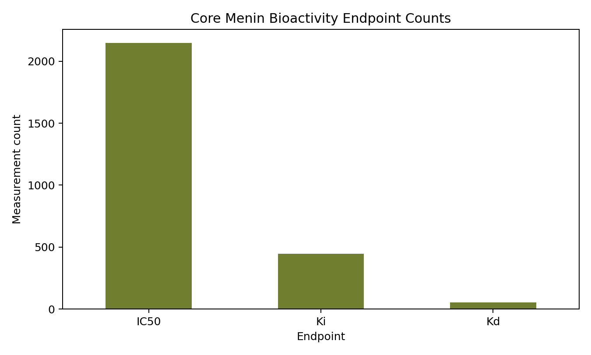
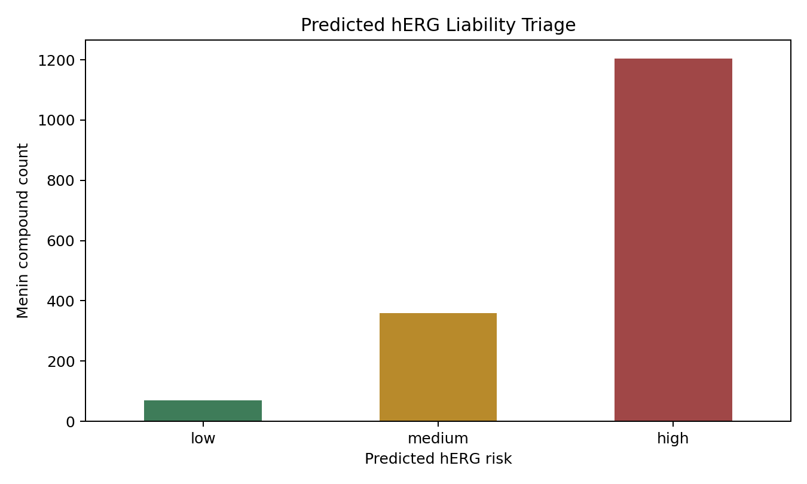

# Menin Inhibitor Discovery: Public-Data Baseline

This repository is a preliminary, reproducible data-and-modeling package for a Menin/MEN1 inhibitor project. It collects public menin-related activity data, curates it into ML-ready tables, adds hERG liability data, extracts observed PK/ADMET rows for menin compounds, and trains dependency-light baseline models.

The goal is to give the lab a clean starting point: not just a spreadsheet, but a versioned workflow that can absorb internal compound structures and assay results.

## Current Results

Generated from public data on 2026-06-09 UTC:

- Menin measurement rows: `3,929`
- Curated unique Menin SMILES strings: `1,634`
- ChEMBL hERG/KCNH2 measurement rows: `41,078`
- Curated hERG/KCNH2 SMILES strings: `11,278`
- Menin-molecule PK/ADMET observation rows: `283`
- Menin activity model: hashed-SMILES Ridge regression, test MAE `0.656` pChEMBL
- hERG classifier: hashed-SMILES logistic regression, test ROC-AUC `0.826`

Primary report: [reports/summary.md](reports/summary.md)

Figures:







## Data Sources

The workflow currently pulls public data from:

- ChEMBL Menin target `CHEMBL1615381`, UniProt `O00255`
- ChEMBL hERG/KCNH2 target `CHEMBL240`, UniProt `Q12809`
- BindingDB Menin and Menin/KMT2A target-index TSV exports
- PubChem BioAssay searches for MEN1/menin/menin-MLL assay terms

Raw source files are preserved under `data/raw/`. Processed, schema-normalized tables are under `data/processed/`.

See [docs/data_source_notice.md](docs/data_source_notice.md) before redistributing data-derived outputs.

## Repository Map

- `scripts/run_pipeline.py`: end-to-end pipeline entry point
- `src/menin_discovery/chembl.py`: ChEMBL target and molecule activity collection
- `src/menin_discovery/bindingdb.py`: BindingDB TSV download and normalization
- `src/menin_discovery/pubchem.py`: PubChem assay search, metadata, and CSV collection
- `src/menin_discovery/curation.py`: unit normalization, pActivity conversion, duplicate aggregation, PK/ADMET filtering
- `src/menin_discovery/features.py`: RDKit-free SMILES featurization baseline
- `src/menin_discovery/modeling.py`: Menin activity and hERG liability baseline models
- `src/menin_discovery/reporting.py`: Markdown summary and figures
- `docs/`: methodology, schema, roadmap, and upload notes

## Quickstart

Install dependencies:

```bash
python3 -m pip install -r requirements.txt
```

Run the full public-data pipeline:

```bash
python3 scripts/run_pipeline.py --stage all --max-pubchem-aids 250
```

Reuse existing raw data and rebuild processed tables:

```bash
python3 scripts/run_pipeline.py --stage data --skip-network
```

Retrain models only:

```bash
python3 scripts/run_pipeline.py --stage models --skip-network
```

Regenerate the report only:

```bash
python3 scripts/run_pipeline.py --stage report --skip-network
```

## Main Outputs

- [data/processed/menin_activity_measurements.csv](data/processed/menin_activity_measurements.csv): measurement-level Menin activity table
- [data/processed/menin_compounds_curated.csv](data/processed/menin_compounds_curated.csv): compound-level Menin modeling table
- [data/processed/herg_activity_measurements.csv](data/processed/herg_activity_measurements.csv): measurement-level hERG activity table
- [data/processed/herg_compounds_curated.csv](data/processed/herg_compounds_curated.csv): compound-level hERG liability table
- [data/processed/pk_admet_observations.csv](data/processed/pk_admet_observations.csv): observed PK/ADMET rows for ChEMBL Menin molecules
- [reports/menin_with_predicted_herg_risk.csv](reports/menin_with_predicted_herg_risk.csv): Menin compounds scored by the hERG baseline classifier

## Important Caveats

This is public-only preliminary work. It does not include internal Wang lab compounds, internal assay metadata, or project-specific decision rules.

The current models are intentionally simple and dependency-light. They validate the workflow, but final decision models should use RDKit descriptors/fingerprints, scaffold/time splits, assay-family stratification, uncertainty estimates, and prospective validation.

PK/ADMET data are extracted as observations, not yet modeled endpoint-by-endpoint. Each PK endpoint needs enough clean, comparable measurements before a defensible model should be trained.

## Best Next Step

Add internal `SMILES`/`SDF`, compound IDs, assay names, exact units, relation qualifiers, and dates into the same measurement schema. Once internal data are present, the biggest upgrade is scaffold-split modeling with RDKit features and endpoint-specific Menin/hERG/PK tasks.
