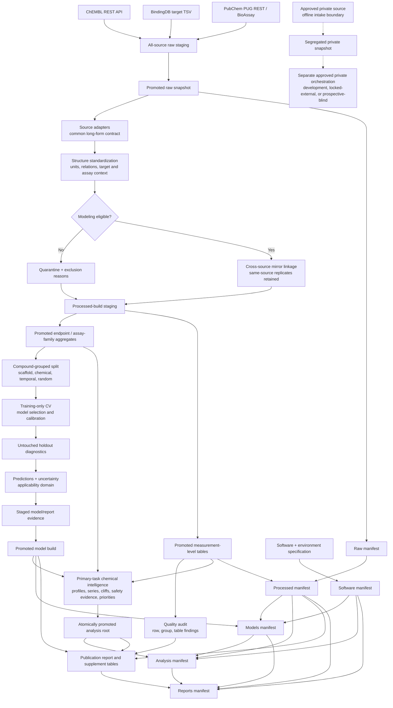

# Architecture

## Design goals

The system is organized around five constraints:

1. Source observations remain traceable and are never overwritten by a compound aggregate.
2. Unsupported units, uncertain targets, invalid structures, and suspect records fail closed.
3. Chemical identity, assay context, endpoint, and censoring semantics are explicit.
4. Model selection occurs inside the training partition, while the holdout remains an evaluation surface.
5. Every reportable build can be tied to input hashes, table schemas, split assignments, software versions, model artifacts, analysis outputs, and reports.

## Data and evidence flow

The dotted private-data route uses the offline `internal_data.py` boundary and separate approved private orchestration; it does not join the public CLI flow. The public `collect`, `curate`, `models`, and `analyze` stages do not ingest confidential files. The intake boundary's existence is not permission to ingest proprietary files and does not secure storage, transfer, or downstream artifacts. It requires the controls in [proprietary data intake](proprietary_data_intake.md).

## Stage contracts

| Stage | Reads | Writes | Invariant |
| --- | --- | --- | --- |
| `collect` | Remote public APIs or an existing snapshot | Source-native files and collection status | All sources are collected in a copied staging snapshot; the configured raw directory is promoted only after successful completion, with rollback on promotion failure. |
| `curate` | Raw ChEMBL, BindingDB, and PubChem files | Measurements, endpoint-aware aggregates, quarantines, source/QC summaries | The complete processed directory is generated in staging and promoted with whole-directory backup/rollback; raw values and relations are retained and unsupported metadata are unresolved rather than guessed. |
| `quality` | Processed Menin, hERG, and PK/ADMET tables | JSON findings and detailed/summary CSVs | Audit is non-mutating and reports every check that can run even if a schema gate fails. |
| `models` | Curated task tables or Menin measurement table for an endpoint-specific task | Serialized estimators, manifests, metrics, comparisons, split assignments, predictions | Models and model-generated report evidence are built in staging and promoted as one successful model-stage transaction; registered structures do not cross train/test or cross-validation boundaries. |
| `analyze` | Primary `IC50 × biochemical_binding` structures, primary-task measurements, PK/ADMET coverage, hERG predictions/observations, configured approved references, prospective-selection policy, and current model lineage | Transactionally replaced `research/analysis/` root containing profiles, series/clusters, novelty, cliffs, matched pairs, connectivity variants, prioritization traces, Pareto/frontier tables, sensitivity results, approved-reference coverage, experiment-design plan/shortfalls, summary, and build metadata | Analysis is primary-task-only and deterministic under the resolved configuration. A complete staging directory is atomically swapped into place; failure restores the prior analysis root. Reference coverage is not an efficacy comparison, and a proposed experiment plan is not prospective validation. |
| `report` | Processed tables, model evidence, and chemical-intelligence outputs when enabled | Markdown, figures, publication tables, report-build metadata | The report-owned surface is rebuilt in staging and promoted with rollback; its pre-manifest digest proves which processed/software/model/analysis bundle generated it. |
| `manifest` | Raw, processed, software, model, analysis, and report roots | Six linked JSON manifests when analysis is enabled; five when disabled | Paths are relative; SHA-256, row count, schema, build ID, and raw → processed; processed/software → models; processed/models/software → analysis; and processed/models/software/analysis → reports dependencies are recorded. Per-model hashes and recorded data/software lineage must match before release manifests can be issued. |
| `verify` | Six required manifests when analysis is enabled, otherwise five, plus current files | Per-stage verification evidence or non-zero failure | File content, recorded metadata, shared build IDs, upstream digest links, declared software/model/analysis/report scope, direct input hashes, model lineage, analysis lineage, and report-build lineage must all match. |

## Module responsibilities

| Module | Responsibility |
| --- | --- |
| `config.py` | Stable target identifiers and source URLs. |
| `settings.py` | YAML loading, override merging, path resolution, and stable settings snapshots. |
| `http.py` | Retrying HTTP sessions, response checks, and atomic text writes. |
| `chembl.py` | ChEMBL status, target search, target activities, and molecule-wide activity collection. |
| `bindingdb.py` | BindingDB target-export retrieval and conversion to the long-form contract. |
| `pubchem.py` | MEN1 target and term searches, assay metadata/data retrieval, download status, and safe loading. |
| `chemistry.py` | RDKit validation, cleanup, fragment-parent selection, neutralization, canonicalization, InChIKey, and stable structure IDs. |
| `curation.py` | Source normalization, unit/relation semantics, target and assay classification, eligibility flags, aggregation, and PK/ADMET rules. |
| `internal_data.py` | Offline CSV/TSV/SDF mapping, assay/endpoint/cohort-role validation, runtime-key HMAC pseudonyms, conflict quarantine, and atomic deterministic private outputs. |
| `quality.py` | Configurable schema, value, unit, identity, target, assay, duplicate, and conflict audits. |
| `features.py` | Morgan fingerprints, physicochemical descriptors, scaffold keys, Tanimoto similarity, and a disclosed fallback backend. |
| `splitting.py` | Compound-grouped random, scaffold, chemical-cluster, and temporal holdouts and cross-validation. |
| `modeling.py` | Candidate selection, calibration, evaluation, uncertainty, applicability domain, safe serialization, and model manifests. |
| `analysis.py` | Primary-task medicinal-chemistry profiles, series/clusters, novelty, activity cliffs, single-cut MMPs, connectivity variants, evidence-aware hERG status, prioritization, Pareto/frontier and sensitivity analysis, approved-reference coverage, and a diversity-capped prospective experiment template. |
| `provenance.py` | Portable content-addressed data manifests and verification. |
| `reporting.py` | Generated summary, figures, and report tables. |
| `cli.py` | Stage orchestration and command-line overrides. |

## Core identities

- `source_record_id` preserves the upstream record identity when one exists.
- `measurement_id` is a deterministic digest of source, source record, compound, assay, endpoint, relation, value, unit, and document fields. It exposes duplicate observations without using row order.
- `original_smiles` preserves submitted structure text.
- `standardized_smiles` is the modeling representation generated by the versioned standardization policy.
- `standard_inchi_key` is generated from the standardized parent.
- `structure_id` is a non-semantic digest of the standardized representation and standardization namespace.
- `full_structure_id` hashes the cleaned full structure before fragment-parent selection.

`structure_id` is a computational grouping key, not a compound-registration identifier. Salt form, tautomer, stereochemistry, isotope state, and lot identity may need separate registered fields in internal data.

## Extension points

### A new public source

Implement a source adapter that returns the long-form measurement contract, retain source-native identifiers, add collection/status metadata, and add source-specific curation tests. Never map an unknown endpoint or unit to a convenient default.

### A private lab source

Use `internal_data.py` inside an approved separate storage root to map CSV, TSV, or SDF fields through versioned assay and endpoint registries. Supply the pseudonymization secret only at runtime; configuration rejects secret keys. The current library covers structures, values/units/relations, compound/batch/assay/row IDs, dates, replicates, targets, assay family, and the controlled cohort roles `development`, `locked_external`, and `prospective_blind`; additional protocol, lot, curve-QC, and release-classification fields still need a governed extension. Only approved `development` rows may enter fitting or exploratory private chemical intelligence. A locked-external build may evaluate the frozen model and analysis specification but cannot tune it. A prospective-blind build must preserve sealed labels until the complete model, thresholds, tiers, and analysis plan are locked, then be unblinded once under the approved protocol. Give each cohort-mode build separate private roots, manifests, build IDs, and access controls. Keep public-only, internal-only, public-trained/private-test, and combined builds distinguishable; never make combined output the only retained result and never point the public CLI at confidential storage.

### A new endpoint

Define endpoint normalization, valid units and ranges, relation/censoring behavior, assay-family mapping, aggregation policy, minimum support, split policy, metrics, and a publication claim boundary. PK/ADMET endpoints should not be pooled merely because they share a category.

### A new model

Add it as a candidate selected only by training-partition cross-validation. Preserve the dummy baseline, split audit, fixed holdout, confidence intervals, applicability-domain diagnostic, serialization trust note, dataset digest, and environment metadata.

## Trust boundaries

- Raw source files are untrusted external input and may change format.
- A successful parser does not imply a measurement is scientifically comparable.
- Serialized model files are executable/trust-sensitive artifacts. `skops` is preferred; `joblib` fallback files must never be loaded from an untrusted source.
- Public availability does not imply public-domain status.
- A model trained on proprietary structures or labels can be proprietary even if the code is public.
- Cohort-role validation at intake is metadata enforcement, not an automatic secure split in the public model CLI; downstream private orchestration must enforce role isolation and preserve sealed prospective labels.
- Predictions are not measurements and must never be written back into observed-value columns.
