# Mechanistic PK + hERG research program

This program is deliberately separate from the original Menin pipeline and Menin-Edit. The legacy command remains `menin-pipeline`; the new command is `menin-research`. `all-local` never executes production MD, PMF, or free-energy jobs.

## Command surface

```bash
menin-research --config pipeline/config/pk_herg_research.yaml \
  --stage literature|normalize|baseline|physics-fast|pk|herg|explain|report|hpc-bundle|all-local
```

`baseline` inventories the existing validated artifacts without rewriting or executing them. Each new stage writes only beneath the `research/data/pk_herg`, `research/models/pk_herg`, `research/reports/pk_herg`, `research/simulations/pk_herg`, and `research/outputs/menin_pk_herg` namespaces.

## Causal scope

```mermaid
flowchart LR
    A["Compound and stereochemistry"] --> B["Protomer/tautomer ensemble"]
    B --> C["Environment-conditioned conformer ensemble"]
    C --> D["Solvation, folding, exposed polarity, membrane partition"]
    D --> E["Dissolution and intestinal access"]
    D --> F["hERG cavity access"]
    E --> G["Permeation, efflux, gut metabolism"]
    G --> H["Portal input and hepatic extraction"]
    H --> I["Distribution and systemic clearance"]
    I --> J["Rat concentration-time exposure"]
    F --> K["Channel-state/receptor-ensemble binding"]
    K --> L["Binding kinetics, trapping, current inhibition"]
    J --> M["Unbound exposure"]
    L --> N["hERG IC50 and kinetic liability"]
    M --> O["Exposure margin"]
    N --> O
```



The arrows are enforced as model-role exclusions. Downstream endpoints cannot be used to fit upstream process parameters. In particular:

- CL and IV dose-normalized AUC are one algebraic target family.
- Reported F is a PO/IV closure output, not evidence that independently identifies Fa, Fg, and Fh.
- A hERG binary class is derived from continuous potency; one-sided limits remain censored.
- Docking scores, unconverged free energies, and PBPK sensitivity profiles are never treated as experimental labels.

## Two tracks

The decision track requires group-held-out calibration, applicability-domain evidence, and non-inferiority to the retained conventional baseline. The discovery track retains converged physical observables that explain residual strata or create a falsifiable prediction even if aggregate error increases. Discovery-track features are not optimizer-ready decision evidence.

## Fast and heavy physics

Fast molecular physics is deliberately deferred to HPC; no local state/conformer output enters this release. The future workflow will enumerate plausible state hypotheses down to a 0.01% sensitivity floor, use 0.1% as the working gate, and preserve rare neutral/zwitterionic and charge/exposure exceptions. RDKit-derived ionization remains an approximation constrained by reported pKa evidence and a ±1-unit sensitivity analysis, not an experimental micro-pKa calculation. HPC enumeration does not inherit the inactive 24-state local guard and must expose any resource truncation and omitted mass explicitly.

The selected 12-compound HPC pilot will test nested 25/50/100/250/500 depths with independent seeds and allocate sampling adaptively by state population, transport relevance, and instability. The values 250 and 500 are a validation ceiling and comparator, not universal per-state prescriptions. The future model-facing ensemble layer is fail-closed to 11 columns representing 10 distinct physical phenomena, and conformer MIL is restricted to nine declared raw physical primitives. Unknown numeric outputs, exact aliases, algebraic closures, force-field energies/ranks, and QC variables remain diagnostic rather than becoming predictors automatically. No physics feature is available for model admission until the state and conformer convergence gates pass.

Heavy physics is emitted as GPU/HPC-ready pilot bundles:

- 12-compound triplicate water/chloroform environment MD;
- four-compound membrane PMF pilot with 64/128 POPC and conditional 256-POPC escalation;
- six-compound, multi-state hERG receptor MD;
- relative free energy only for charge-preserving local matched-pair cycles.

Convergence gates are mandatory before observables enter a learned model. The bundle metadata carries replica agreement, PMF evolution, leaflet symmetry, coordinate/hysteresis, force-field, patch-size, and cycle-closure criteria.

## Validation

Primary evidence is series/scaffold held out. Random compound splits can be reported only as a sensitivity comparison. Model selection, calibration, threshold choice, and final evaluation are separated. The complete explanation contract for every run includes:

1. dataset and split definition;
2. metrics and uncertainty;
3. calibration and applicability domain;
4. residual clusters and feature-layer ablations;
5. matched-pair behavior;
6. a proposed mechanism and competing explanations;
7. a falsifying simulation or assay;
8. decision-track, discovery-track, or rejected status.

## Molecular-weight regimes

MW ≥650 Da is an inclusion description. Candidate breakpoints from 650–780 Da are compared to continuous models and bootstrapped by scaffold. A single cutoff is accepted only when selection frequency, location precision, direction stability, and cross-outcome replication all pass. Otherwise the program reports no single cutoff and defines regimes from charge behavior, exposed polarity, flexibility, and folding.

## Optimizer boundary

The optimizer contract contains one row per structure with separate continuous endpoint means, intervals, uncertainty, applicability-domain status, promotion status, and required-data flags. It explicitly contains `scalar_objective=NOT_DEFINED`, `molecule_rank=NOT_COMPUTED`, and `generation_allowed=false`.
