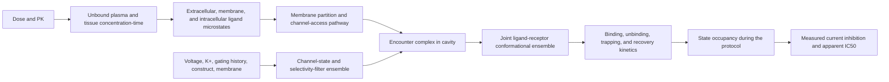

# hERG process map for large molecules

## Objective

Predict and explain hERG current inhibition and safety margin for large molecules by separating exposure, access, channel-state selection, binding, kinetics, and assay observation. A pooled IC50 classifier is a necessary baseline but cannot identify the cause of block or transport across a new chemical domain.

The hERG model should answer three different questions:

1. What unbound ligand species reaches the channel and by what route?
2. Which channel states does each ligand microstate bind, with what thermodynamics and kinetics?
3. How does a specified electrophysiology protocol turn those processes into observed current inhibition?

## Causal graph

This graph separates intrinsic channel liability from clinical risk. A potent blocker with negligible free exposure may have a large safety margin; a moderate blocker with high unbound cardiac exposure, slow dissociation, or trapping may remain dangerous. Both components and their uncertainty must be retained.

The Di/Kerns chapter supplied by Dr. Aguilar gives the historical medicinal-chemistry
baseline: basicity, lipophilicity, aromatic/hydrophobic groups, cavity access, open-state
binding, trapping, and unbound exposure margin. It is not a current quantitative rulebook.
The chapter predates modern cryo-EM and contains contradictory advice on whether oxygen
H-bond acceptors should be added or removed. Its `IC50/Cmax,unbound > 30` margin is
retained only as a historical comparator, never as a universal safety guarantee.

## Process states

### 1. Ligand identity, microstates, and conformers

Enumerate protomers, tautomers, stereoisomers, and environment-conditioned conformers. A nominal formal charge is inadequate: membrane partition can enrich one state, and a rare species can dominate access or binding. Record microscopic-pKa uncertainty, charge distribution, exposed aromatic and polar patches, and state-exchange kinetics.

### 2. Free concentration and membrane access

Use unbound concentration, not total nominal concentration. Model plasma/tissue binding, membrane partition, intracellular accumulation, lysosomal trapping where relevant, and the sided route to the hERG cavity. Time to equilibrate near the channel can differ from bulk exposure time.

Candidate state variables:

- unbound extracellular and intracellular concentrations;
- membrane/water partition by microstate;
- orientation and conformer population in the bilayer;
- access-barrier distribution and local diffusivity;
- intracellular sequestration and washout; and
- assay equilibration time relative to access time.

This layer links the PK and hERG programs. It also creates an important tradeoff: increased hydrophobic cationic character may improve membrane access while increasing cavity recognition.

### 3. Channel gating and selectivity-filter ensemble

hERG is not one receptor structure. Condition the ensemble on voltage, gating history, potassium, temperature, construct, membrane composition, and ligand occupancy.

Lau et al. supply high-K/low-K C1/C4 filter states. Potassium departure, V625 carbonyl flips, and S620 stabilization define candidate inactivated/nonconducting coordinates. Reported barriers around 4-5 kcal/mol and small relative free energies imply that modest perturbations can shift populations. Three-versus-four subunit flips and the physiological rate-limiting step remain unresolved, so filter state must remain probabilistic.

State dependence is also ligand-specific rather than a single global rule. Trapped-open
channel experiments found that the extent of cisapride and terfenadine block did not track
the degree of inactivation, while pH/dofetilide and other studies support drug-specific
coupling to inactivated or deactivated/trapped states. The model must infer or measure the
relevant state dependence per ligand/protocol instead of assigning all blockers to one
preferred channel state.

### 4. Cavity recognition and receptor reorganization

Miyashita et al. provide apo, astemizole-, E-4031-, and pimozide-bound structures. Recurrent physics includes a protonated/cationic center below the filter, interactions with S624 and Y652, ligand-specific T623/S649 contacts, Y652 symmetry breaking, near-degenerate poses, and indirect/allosteric F656 changes.

Represent the joint ligand-receptor ensemble:

- pose populations and pose entropy;
- cation-pi and aromatic geometry;
- hydrogen-bond and retained-water occupancy;
- desolvation and cavity-entry cost;
- Y652/F656 rotamer combinations;
- receptor strain and symmetry breaking;
- compatibility with high-K/low-K filter states; and
- uncertainty from density and structure preparation.

A docked pose or GBVI/WSA score is a hypothesis generator, not a binding free energy.

### 5. Binding and block kinetics

Separate kon, koff, equilibrium affinity, channel-state transition rates, and trapped fraction. Apparent IC50 changes with incubation time and gating protocol when access or dissociation is slow. A large molecule may exhibit slow cavity entry, multiple metastable poses, or membrane-limited washout.

Ultimately represent a continuous-time Markov model over unbound, encountered, bound, trapped, conducting, open, inactivated, and recovered states. Initially, use a reduced state model identifiable from available onset/washout electrophysiology.

The primary mechanistic output is protocol-integrated bound/trapped occupancy and recovery,
not a docking score or one equilibrium IC50. Static conductance scaling and state-dependent
binding models are not interchangeable when onset, washout, or gating history matters.

### 6. Electrophysiology observation model

The measured endpoint depends on cell system, species/construct, voltage sequence, holding potential, pulse duration/frequency, extracellular potassium, temperature, exposure duration, washout, concentration range, fitting equation, and current-quality criteria. Treat these fields as causal context, not nuisance columns.

IC50 is an observation derived under one protocol. Store exact, censored, interval, and qualitative values separately. Do not pool incompatible protocols without hierarchical context effects.

## Model layers

### Layer 0: conventional comparator

Recurate the Sun et al. workbook and current data. Compare fingerprints, physicochemical descriptors, atom-type/correction-factor reconstruction, graph models, and conformer-aware generic models. Use random splits only as a diagnostic; primary validation uses scaffold, temporal, source-held-out, protocol-held-out, and intended-domain splits.

### Layer 1: mechanistic low-cost features

- microstate distributions and pH sensitivity;
- conformer-ensemble exposed charge, aromaticity, polarity, and shape;
- membrane partition/access priors;
- transparent pharmacophore geometry against multiple cavity structures;
- filter- and side-chain-state compatibility;
- complete protocol context; and
- applicability distance in chemistry, microstate, conformation, receptor interaction, and assay space.

### Layer 2: explicit receptor ensemble

Prepare and validate only the six canonical raw-coordinate hypotheses: 8ZYN, 8ZYO, 8ZYP, 8ZYQ, 9CHP, and 9CHQ. The first four form one recent matched cavity series spanning apo and three inhibitor-bound structures; the last two form a matched C4 high-/low-potassium filter contrast. Do not expand the active ensemble with lower-resolution correlated reconstructions by default: 9CHR/9CHS are reserved for a preregistered C1-asymmetry sensitivity, 5VA1/5VA2 are older truncated constructs, and 5VA3 is an S631A non-inactivating mutant. Generate microstate-specific pose ensembles, local relaxation, water networks, and uncertainty only after map/construct/preparation review. Fit population-weighted models under physical constraints rather than concatenating thousands of uninterpretable docking scores.

### Layer 3: targeted thermodynamics and kinetics

For a small information-rich panel, use enhanced sampling or alchemical calculations across plausible microstates and receptor states; use milestoning, weighted ensemble, metadynamics, or related methods for access/unbinding when justified. Compare calculated perturbations within matched ligand series before trusting absolute values.

## Validation metrics

### Classification

ROC-AUC, PR-AUC, balanced accuracy, MCC, sensitivity and specificity at declared thresholds, Brier score, calibration intercept/slope, reliability curves, expected calibration error, and decision utility. Report blocker as the explicit positive class regardless of source coding.

### Regression

MAE, median absolute error, RMSE, R-squared, Spearman correlation, signed bias, fraction within 0.5 and 1 log unit, censor-aware likelihood, and interval coverage. Keep units and conversion explicit.

### Kinetic and protocol validation

Onset and washout time-course likelihood, kon/koff or relaxation-rate error, trapped-fraction error, state/protocol transfer, concentration-response hysteresis, and prediction of potassium/voltage/time perturbations.

### Domain and explanation validation

Report all metrics against scaffold novelty, nearest-neighbor similarity, molecular-weight/shape band, charge state, conformational complexity, receptor-state disagreement, and protocol completeness. Evaluate whether the explanation predicts intervention direction across matched analogs and mutants. Feature attribution alone is not a causal test.

## Fundamental failure signatures

- Good random split but poor scaffold split: chemical memorization.
- Good equilibrium fit but wrong onset/washout: kinetics collapsed into affinity.
- Protocol-dependent residuals: observation model missing gating or timing.
- Error correlated with membrane partition or size: access omitted.
- Opposite predictions across receptor structures: receptor-state uncertainty dominates.
- Strong dependency on one protonation choice: microstate uncertainty dominates.
- Mutational effect without direct-contact consistency: allostery or state redistribution, not a simple pairwise interaction.
- Confidence remains high far from training chemistry: uncertainty model failure.

## Limited-data strategy

Current data can support comparator reconstruction, typed labels, applicability auditing, structural hypothesis generation, and small prospective panels. It cannot identify a full kinetic Markov model or validate large-molecule transfer.

Use multi-task and hierarchical models to share information while retaining endpoint/protocol identity. Use public data for broad priors, internal data for the target domain, and physics calculations for selected states. Never let the public dataset dominate aggregate metrics. Preserve unknowns and abstain outside supported regions.

The highest-value new hERG data are concentration-response curves with full protocol metadata, onset/washout kinetics, multiple pulse or potassium conditions, free rather than nominal concentrations, and matched large-molecule analog series. These measurements distinguish access, equilibrium affinity, and trapping far better than additional heterogeneous one-number IC50 records.

## Integration with optimization

The final decision surface should retain at least:

- probability of achieving the desired unbound exposure;
- distribution of hERG occupancy/block over that exposure profile;
- safety margin under plausible PK and electrophysiology conditions;
- kinetic/trapping risk;
- mechanistic and applicability uncertainty; and
- opportunity for a specific chemical edit to improve one process without degrading another.

Use Pareto optimization and robust constraints rather than a single early weighted score. Generate chemical hypotheses at the process level: reduce persistent membrane-exposed cationic aromatic states, destabilize Y652-compatible poses, speed dissociation, or preserve transient polarity masking for absorption while avoiding a high hERG cavity-access state. Test predicted interventions prospectively.

## Immediate deliverables

1. Recurated hERG observations with explicit source, units, censoring, protocol, and positive-class polarity.
2. Strong conventional baselines and applicability-stratified validation.
3. Locally validated receptor/filter ensemble from the identified PDB/EMDB assets.
4. Tier-1 microstate, membrane-access, and state-specific interaction features.
5. A small kinetic electrophysiology panel chosen to separate affinity, access, and trapping.
6. Joint PK-hERG exposure-margin simulation with propagated uncertainty.

The program succeeds when it can state which physical step produced a risk prediction, how that statement could be falsified, and where the evidence is too weak to decide.
