# Mechanistic feature evidence and novelty audit

**Audit date:** 2026-07-21  
**Scope:** large-molecule rat PK and hERG; exact audit of the historical 11 fast-physics columns, their biological meaning, precedent, novelty, failure modes, and more fundamental successors.

## Executive conclusion

The number 11 is not a scientific constant and must not be presented as a final parameter count. It was a historical implementation allowlist containing 11 columns for ten proposed phenomena because NPR1 and NPR2 jointly encode one shape coordinate. The historical nine conformer-level columns were a separate multiple-instance representation, not nine additional biological mechanisms; the post-audit conformer allowlist now contains five raw surface/size primitives.

The literature audit changes the interpretation materially:

1. **The broad mechanisms are mostly established.** Ionization, exposed polarity, hydrophobic contact, compactness/shape, intramolecular hydrogen bonding, and conformational exchange all have primary-literature precedent. Renaming or algebraically combining them does not make the mechanisms novel.
2. **Several exact aggregations appear repository-specific, but that is weak novelty, not validation.** A weighted 5th percentile, IMHB count divided by polar SASA, combined donor-plus-acceptor surface fraction, and charge-centroid separation divided by radius of gyration were not found as established PK/hERG parameters in the searched primary literature. They remain hypotheses until perturbationally validated.
3. **Two current columns are scientifically inadequate as predictors.** `absolute_formal_charge__mean` is the absolute value of *net* formal charge and therefore cannot distinguish a neutral molecule from a net-zero zwitterion. `joint_conformational_entropy_normalized` is entropy over generated ETKDG/MMFF/UFF hypotheses, not thermodynamic conformational entropy; it is driven by enumeration and force-field weighting.
4. **One current composite erases a demonstrated physical asymmetry.** Combining exposed H-bond donor and acceptor surface is not justified as a final burden because donor masking can improve bRo5 permeability even when molecular weight and acceptor count increase.
5. **Static compactness alone is not causal.** Recent large PROTAC evidence shows that extended, oriented conformations can be favorable within the membrane and that excessive interfacial affinity can reduce permeability by trapping a molecule before release. The relevant object is a position-, environment-, and pathway-conditioned free-energy/kinetic model, not simply low radius of gyration.
6. **The strongest potentially distinctive contribution is the causal integration, not any single descriptor:** microstate-specific local electrostatics, environment-conditioned conformational basins and exchange rates, membrane-path thermodynamics/kinetics, hERG receptor-state binding/trapping, assay context, and propagated uncertainty in one falsifiable PK/hERG model.

No current fast-physics column is decision-track eligible. The retained columns are either conventional controls, provisional low-cost proxies, mechanistic diagnostics, or explicit hypotheses for later simulation/assay falsification.

## Evidence and novelty standard

Every parameter is evaluated on five separate questions. These must not be collapsed into one “novel/not novel” label.

| Dimension | Question |
|---|---|
| Mechanism precedent | Has the biological/physical event been demonstrated in primary literature? |
| Exact-feature precedent | Has this exact mathematical representation been used and validated for PK, permeability, or hERG? |
| Computational validity | Does the current calculation estimate the named physical quantity under its assumptions? |
| Domain relevance | Is the evidence transferable to flexible 650–813 Da internal compounds and the target assays? |
| Causal adequacy | Would an intervention on the proposed mechanism predict a corresponding change in the outcome, including negative controls? |

Novelty grades used here are:

- **Established:** mechanism and closely related representation have direct precedent.
- **Extended:** established mechanism with a new aggregation or conditioning choice.
- **Candidate:** exact construction was not found in the searched primary literature and has a plausible causal chain, but is not validated.
- **Unsupported novelty:** exact construction may be new because it is not yet a faithful estimator of the claimed physics.
- **Rejected as predictor:** retain only for QC, sensitivity, or provenance.

Absence from a literature search cannot prove universal novelty. “Candidate” therefore means “no exact precedent found in the documented search,” never “first in the world.” A defensible novelty claim later requires a reproducible database/patent search and independent experimental confirmation.

## The biological event chain that determines the feature ontology

The ontology is derived from causal transitions, not descriptor availability.

```mermaid
flowchart LR
    A["Administered material"] --> B["Dissolved free monomer"]
    B --> C["Solution protomer/tautomer ensemble"]
    C --> D["Aqueous conformational basins"]
    D --> E["Membrane-interface encounter and orientation"]
    E --> F["Charge/polarity shedding and conformational gating"]
    F --> G["Bilayer-core crossing"]
    G --> H["Rehydration and release"]
    H --> I["Enterocyte, efflux, gut loss, portal input"]
    I --> J["Hepatic extraction, distribution, and elimination"]
    J --> K["Unbound systemic exposure"]
    E --> L["hERG-accessible membrane/cavity pool"]
    L --> M["Channel-state-specific encounter"]
    M --> N["Binding, induced fit, and trapping"]
    N --> O["Protocol-conditioned current inhibition"]
```

A feature is admissible only when it represents one of these nodes or edges, is not algebraically downstream of the label being predicted, has explicit uncertainty, and has a falsification experiment.

## Exact audit of the historical 11 columns

### 1. `formal_charge__mean`

**Definition.** Population-weighted mean net formal charge over retained chemical states.

**Mechanistic chain.** Microscopic protonation/tautomer equilibria determine state populations; net charge changes hydration, neutral-membrane access, membrane accumulation, and the probability of presenting a cationic center to the negative hERG cavity.

**Evidence.** Ionization is an established determinant, but the effect is conditional. Qi et al. show that state identity matters beyond net charge, while a 6,690-compound hERG analysis found that the effect of lipophilicity depends on ionization class. Miyashita et al. place protonatable piperidine centers in a negative pore electrostatic environment, alongside hydrogen-bond, aromatic, and induced-fit interactions.

**Novelty verdict.** **Established control; not novel.** Population weighting is appropriate in principle, but current weights are uncertain because macroscopic pKa evidence and approximate tautomer handling do not determine microscopic-state free energies.

**What it misses.** Two zero-net-charge states can have radically different local charge separation, hydration, orientation, and permeability. A mean also hides a rare high-flux state.

**More fundamental successor.** Preserve the microstate population vector; site-resolved microscopic pKas; separately exposed positive and negative charge patches; state-specific hydration/transfer free energies; state-exchange rates; and flux contribution

\[
\phi_s=\frac{f_sP_s}{\sum_j f_jP_j},
\]

where both population \(f_s\) and state-specific permeability \(P_s\) carry uncertainty.

**Falsification.** Measure permeability and hERG potency across pH for matched compounds with microscopic-pKa assignments. The predicted state-specific direction must hold; an unchanged outcome despite a large, verified population shift falsifies the proposed role for that endpoint.

### 2. `absolute_formal_charge__mean`

**Definition.** Population-weighted mean of `abs(net formal charge)`.

**Mechanistic claim originally intended.** Charge magnitude independent of sign should encode hydration and low-dielectric transfer burden.

**Critical defect.** This implementation is **not total charge burden**. A neutral tautomer and a zwitterion both have net charge zero and therefore both receive zero. Qi et al. report approximately six orders of magnitude difference in state-specific permeability between two zero-net-charge tetracycline states, caused mainly by a roughly 9.1 kcal/mol PMF-barrier difference, distinct orientation, and retained hydration. This feature cannot represent that mechanism.

**Novelty verdict.** **Rejected as a mechanistic predictor.** The problem is not lack of novelty; the calculated quantity does not estimate its stated phenomenon.

**More fundamental successor.** Separate positive and negative formal-charge magnitudes; charge-patch surface and separation; microstate-specific electrostatic-potential maps; explicit hydration free energy; retained-water count and residence; dielectric response; and membrane-depth-dependent polarization. For hERG, use the geometry and desolvation of the relevant cationic center relative to S624/Y652/cavity electrostatics rather than global magnitude.

**Falsification.** Include matched neutral and net-zero zwitterionic microstates. Any replacement must distinguish their measured hydration/partition/permeability while remaining stable across charge models.

### 3. `polar_sasa_ang2__q05`

**Definition.** Population-weighted 5th percentile of solvent-accessible polar surface over retained state/conformer hypotheses.

**Mechanistic chain.** A low-polar-exposure conformer can reduce the cost of shedding water and entering a low-dielectric environment. The lower tail is intended to represent conformational selection rather than the average aqueous structure.

**Evidence.** Conformationally dependent 3D PSA has strong precedent. A 2012 study calculated radius of gyration, 3D PSA, and GB/SA dehydration free energy for more than 35,000 compounds. Rossi Sebastiano et al. later found minimum solvent-accessible 3D PSA strongly associated with passive permeability in a diverse bRo5 set. Poongavanam et al., cyclic-peptide studies, and the 2025/2026 PROTAC and macrocycle studies provide additional matched-series support. Experimental EPSA and chromatographic chameleonicity assays further establish dynamically exposed polarity as a useful, though not sufficient, observable.

**Novelty verdict.** **Extended, not mechanism-level novel.** The exact weighted q05 choice was not found as a validated universal parameter. It is a robust operational alternative to an unstable minimum, not a biological constant.

**What it misses.** A rare conformation is irrelevant if it is kinetically inaccessible on the membrane encounter timescale. Aqueous low-polarity does not guarantee low polarity at the interface or core. A global SASA also loses site identity, hydrogen-bond strength, retained waters, and orientation.

**More fundamental successor.** Environment- and membrane-depth-conditioned polar-surface distributions; site hydration free energies and water residence; polar-surface change along reactive pathways; transfer PMF and diffusivity; and reactive flux through low-polarity basins.

**Falsification.** Test q01/q05/q10 and physically fixed tail thresholds under nested conformer sampling. A tail proxy survives only if its direction is stable and explicit-solvent or NMR ensembles confirm the same low-polarity basin.

### 4. `nonpolar_sasa_ang2__mean`

**Definition.** Population-weighted mean accessible nonpolar surface.

**Mechanistic chain.** Nonpolar surface provides favorable dispersion/contact with lipid tails and hydrophobic receptor regions, partly compensating polar desolvation.

**Evidence.** Hydrophobicity is a long-established determinant of membrane partition and hERG promiscuity. The 2025 Matsson PROTAC study is especially informative: greater nonpolar exposure can compensate increased polar exposure in extended membrane-core conformations, but increased lipophilicity can also deepen an interfacial minimum and reduce permeability by impeding release. Mutational hERG studies support hydrophobic/aromatic cavity interactions, while large screening collections associate hERG block with lipophilicity in an ionization-dependent manner.

**Novelty verdict.** **Established mechanism; exact mean is not novel and is not sufficient.**

**What it misses.** Surface area is not transfer free energy. It ignores atom type, polarizability, topology, orientation, free monomer activity, aggregation, protein/lipid binding, and whether the rate-limiting barrier is insertion, flip-flop, or desorption.

**More fundamental successor.** Water-to-interface and water-to-core transfer free energies; interfacial-well depth; core barrier; release barrier; lipid-contact identity and occupancy; orientation-conditioned nonpolar exposure; free monomer activity; and receptor-local hydrophobic contact free energy.

**Falsification.** Matched lipophilicity edits must distinguish enhanced core entry from pathological interfacial trapping. Liposome partition, passive permeability, solubility, recovery, and membrane binding should be measured together.

### 5. `radius_of_gyration_angstrom__q05`

**Definition.** Population-weighted 5th percentile of radius of gyration.

**Mechanistic chain.** Compact conformers may reduce cross-section or allow polarity masking and cavity accommodation.

**Evidence.** Radius of gyration has been used in bRo5 permeability work for more than a decade and in the attached PROTAC studies; it is therefore not novel. Poongavanam et al. support a compact/polarity-masked ensemble in a three-compound series. Kim et al. report Rg as influential in a small 32-degrader analysis. However, later matched studies show that Rg and exposed polarity can rank compounds differently, Matsson et al. show that extended, oriented states inside the membrane may be favorable, and Schade et al. report globally extended oral PROTACs with site-specific donor shielding.

**Novelty verdict.** **Established diagnostic; q05 is not admitted automatically to the model.**

**What it misses.** Rg conflates size and folding, does not identify which groups are shielded, and cannot distinguish a compact polar globule from an elongated amphiphile with a low-barrier orientation. The q05 state may have negligible population or slow access.

**More fundamental successor.** Joint free-energy surfaces over Rg, exposed polarity, IMHB network, orientation, and membrane depth; common compact-basin definitions; basin populations; transition rates; and membrane-path committors.

**Falsification.** A compactness intervention should alter the prespecified coupled basin and the corresponding rate/barrier. If Rg changes without the predicted local shielding, orientation, or permeability change—or if an extended state carries the productive flux—compactness is a correlate rather than the cause.

### 6–7. `npr1__mean` and `npr2__mean`

**Definition.** Mean normalized principal-moment ratios. Together the pair distinguishes rod-, disk-, and sphere-like mass distributions.

**Mechanistic chain.** Shape anisotropy can affect membrane orientation, cross-sectional accommodation, cavity entry, and receptor fit.

**Evidence.** NPR is a standard molecular-shape representation and appears directly in the Poongavanam PROTAC analysis. The evidence there is limited to three related compounds. Shape has older hERG pharmacophore precedent, but receptor recognition depends on local interaction geometry and channel state rather than a global NPR coordinate alone.

**Novelty verdict.** **Established diagnostic; not novel.** The two columns are one physical coordinate and must never be counted as two independent mechanisms.

**What it misses.** The mean of a multimodal ensemble can be a shape that is never populated. Global mass moments do not specify orientation, local cross-section, component vectors, or compatibility with a membrane/receptor state.

**More fundamental successor.** Basin-conditioned shape distributions; depth-dependent orientation; POI-linker-E3 vectors for degraders; projected cross-section; local curvature; steric accommodation and contact maps; receptor/ligand joint-state populations.

**Falsification.** Compare predicted orientation and accommodation against explicit membrane/receptor ensembles. NPR should add no independent causal claim when those direct variables are available.

### 8. `joint_conformational_entropy_normalized`

**Definition.** \(-\sum_iw_i\log w_i/\log N\) over enumerated state–conformer hypotheses.

**Mechanistic claim originally intended.** Multiple populated conformations may provide alternative transport or binding routes.

**Critical defect.** Thermodynamic conformational entropy requires meaningful equilibrium state probabilities and basin degeneracies. Current weights derive from approximate state weights and minimized MMFF/UFF energies over generated ETKDG structures; changing enumeration, clustering, caps, force field, or duplicate basin representation changes the value. Normalization by \(\log N\) does not repair those problems.

Static diversity is also directionally ambiguous: it can increase access to a transport-compatible state, increase the conformational free-energy cost of binding, or slow interconversion through high barriers. Primary cyclosporine evidence shows that *rates* of interconversion, not simply the number of conformations, can distinguish permeability.

**Novelty verdict.** **Rejected as a molecular predictor; retain as sampling diagnostic only.** Its exact use may be uncommon because it is not yet a thermodynamic observable.

**More fundamental successor.** Metastable-basin free energies and populations; effective state count over kinetically defined basins; transition matrix; implied timescales; exchange rates; spectral gap; mean first-passage time; committor; transition-path flux; and environment-specific conformational entropy with convergence.

**Falsification.** Independent enhanced-sampling replicas and NMR exchange measurements must reproduce basin populations and timescale ordering. A value that changes materially with generated-conformer count is algorithmic QC, not chemistry.

### 9. `composite__exposure_adjusted_hbond_burden`

**Definition.** Population-weighted mean of

\[
\frac{SASA_{HBD}+SASA_{HBA}}{SASA_{total}}.
\]

**Mechanistic chain.** Exposed donor and acceptor sites must exchange favorable water hydrogen bonds for weaker or different partners during membrane/cavity transfer.

**Evidence.** The broad dehydration mechanism is strongly established, but donor and acceptor penalties are not interchangeable. Barlow et al. improved bRo5 permeability by masking HBDs even while adding mass and acceptors. Recent matched macrocycle work also localizes permeability changes to the exposure or shielding of particular amide bonds and NH–π/IMHB interactions.

**Novelty verdict.** **Candidate exact composite, but currently over-compressed.** Combining HBD and HBA surfaces erases demonstrated asymmetry; dividing by total SASA can also make the same absolute polar burden appear smaller in a larger molecule.

**Current role.** Diagnostic only. Do not call it a final transfer-energy parameter.

**More fundamental successor.** Separate donor and acceptor exposed surface; site-resolved hydration free energies, water occupancy/lifetime, strength and geometry; local electrostatic potential; lipid/receptor partner availability; and membrane-depth-dependent hydrogen-bond exchange.

**Falsification.** Use matched donor-to-acceptor swaps, N-methylation, and amide-to-ester changes. A valid model must predict donor/acceptor-asymmetric permeability and must not infer a false benefit solely from increasing total nonpolar surface.

### 10. `composite__intramolecular_shielding_candidate`

**Definition.** Population-weighted geometric IMHB contact count divided by polar SASA.

**Mechanistic chain.** Persistent, correctly oriented intramolecular hydrogen bonds can replace water interactions, mask polarity, and lower the cost of entering a low-dielectric phase.

**Evidence.** The mechanism has substantial primary precedent across cyclic peptides, macrocycles, and PROTACs, including stereospecific matched compounds. It is context-dependent: cyclization or a geometric donor–acceptor opportunity does not guarantee improved permeability, and the relevant network may change with solvent or membrane position.

**Novelty verdict.** **Candidate exact proxy; mechanism not novel.** No primary precedent was found for this exact normalization. A distance-only count lacks angle, strength, solvent competition, occupancy, lifetime, and network cooperativity.

**Current role.** One-at-a-time falsification hypothesis, not a core physical parameter.

**More fundamental successor.** Environment-conditioned IMHB graph states; occupancy and lifetime; exchange with water and lipid/receptor partners; cooperative network free energy; solvent isotope/temperature dependence; NMR temperature coefficients and H/D exchange.

**Falsification.** Perturb a proposed IMHB without materially changing the rest of the molecule. NMR or explicit-solvent simulation must confirm occupancy/lifetime, and permeability must move in the predicted environment-dependent direction.

### 11. `composite__charge_separation_per_gyration_candidate`

**Definition.** Population-weighted distance between positive and negative Gasteiger partial-charge centroids divided by radius of gyration.

**Mechanistic chain.** A normalized electrostatic topology could influence membrane orientation and electrostatic complementarity in the hERG cavity.

**Evidence.** Dipole, charge distribution, membrane orientation, and local hERG electrostatics are established concepts. No exact PK/hERG precedent was found for this centroid/Rg ratio. Miyashita et al. support a *local* cationic center in a negative cavity together with S624/Y652 interactions and receptor reorganization; they do not validate a global ligand centroid ratio.

**Novelty verdict.** **Candidate exact construction with weak current physical fidelity.** It is not ready for a novelty claim or model promotion.

**What it misses.** Gasteiger charges omit polarization and environment response; one global centroid erases multiple charge patches; normalization can alias different topologies; and no receptor or membrane field appears in the calculation.

**More fundamental successor.** Microstate-specific electrostatic-potential surfaces; exposed positive/negative patch areas and distances; multipole tensor; environment-polarized charges; orientation-dependent interaction with membrane electric field; and local cavity complementarity/desolvation for each receptor state.

**Falsification.** Matched-pair ordering must survive several charge models and predict independent orientation/electrostatic measurements. Reversal under a reasonable charge model invalidates the feature.

## Proposed new method: the State–Path–Flux feature layer

The proposed project method is not “calculate unusual scalar descriptors and hope they correlate.” It is a **State–Path–Flux (SPF) causal feature layer** that converts molecular physics into the biological event rates that generate PK and hERG observations.

This name is an internal proposal, not a claim that every mathematical component is unprecedented. Markov states, PMFs, committors, PBPK, and state-dependent channel models all have precedent. The potentially new contribution is their molecule-specific coupling into one uncertainty-aware feature layer for large-molecule PK and hERG, with a strict replacement path from inexpensive proxy to direct physical observable.

### SPF representation

For a compound, define a state

\[
x=(m,c,e,r,b),
\]

where \(m\) is chemical microstate, \(c\) is conformational basin, \(e\) is environment or membrane depth, \(r\) is receptor/channel state when applicable, and \(b\) is the biological compartment. Nodes carry free energy, population, local electrostatic/hydration state, and uncertainty. Edges carry rates for protonation, conformational exchange, partition, permeation, binding, trapping, metabolism, transport, or compartment exchange.

The model consumes a deliberately small set of **functionals of this network**, not every node property:

1. **Flux-weighted transport-state exposure**

   \[
   A_{polar}^{flux}=\sum_{\gamma}\Phi_{\gamma}\,A_{polar}(\gamma),
   \]

   where \(\Phi_{\gamma}\) is the normalized reactive flux through pathway \(\gamma\). This replaces an arbitrary q05 once transition information exists.

2. **Conformational-gating time/cost**: the mean first-passage time and free-energy barrier from the aqueous ensemble to a membrane-competent state. This distinguishes “a rare state exists” from “the state can be reached during membrane encounter.”

3. **Desolvation-compensation balance**

   \[
   \Delta G_{shed}^{net}=\Delta G_{lost\ hydration}
   +\Delta G_{IMHB/lipid/receptor\ compensation},
   \]

   calculated site by site and along the path. This replaces SASA/count arithmetic with energy accounting.

4. **Interfacial-trapping index**: the larger of the barriers from the dominant membrane interfacial well toward the core or back to water, reported together with the identity of the limiting direction. This captures the two permeability failure modes observed in the 2025 PROTAC study.

5. **Microstate-switch coupling**: the probability that a membrane-accessible neutral or shielded state converts into a high-affinity hERG-binding state within the local residence time. This directly tests the proposed *charge-gated access-and-binding* mechanism.

6. **State-conditioned hERG occupancy and trapping burden**: time-integrated bound/trapped occupancy under the declared voltage protocol and free-concentration history, rather than a generic docking score.

7. **Bottleneck attribution**: fraction of total resistance or reactive flux assigned to dissolution, conformational gating, membrane entry, core crossing, release, efflux, hepatic loss, receptor access, binding, or trapping. This is the mechanistic explanation returned with every prediction.

### Why this is more fundamental than the current 11

The current columns summarize structural possibilities. SPF asks which possibilities participate in productive biological paths and at what rates. It naturally explains why:

- a 0.14% state can dominate transport;
- an apparently favorable hydrophobic molecule can become trapped at an interface;
- a compact conformation can be less useful than an extended, correctly oriented one;
- two compounds with similar equilibrium hERG potency can differ in onset, recovery, and trapping; and
- the same chemical edit can improve oral absorption while worsening hERG access.

### Efficient implementation without pretending the current data are richer than they are

SPF is implemented in increasing fidelity:

- **Level A — now:** conventional 2D baselines plus the few interpretable fast proxies, typed assay context, uncertainty flags, and causal ablations. No deferred structure generation is required.
- **Level B — selected compounds on HPC:** environment-conditioned basin populations and transition networks, site hydration, membrane profiles, and receptor-state ensembles.
- **Level C — only where experiments identify the rates:** gray-box PK ODEs and hERG continuous-time Markov models.

Missing Level B/C quantities are uncertain latent variables, not invented point estimates. A hybrid model predicts them only when supported, and a learned residual captures remaining structure–outcome signal without relabeling correlation as physics.

### Strong-model ladder built around SPF

1. Reproduce a strong conventional structure-only baseline under series/scaffold splits.
2. Add each causal module separately and require a predicted residual signature, matched-pair direction, and calibration—not merely a higher global score.
3. Fit a state-aware multiple-instance model when real conformer/microstate ensembles exist; do not average away multimodality.
4. Fit a constrained gray-box PK or hERG state model only for identifiable parameters.
5. Add a learned residual to the mechanistic prediction, while reporting the mechanistic and residual contributions separately.
6. Use ensemble/model uncertainty and applicability distance to decide whether an output is decision-track or discovery-track.

This produces competitive predictive models while preserving the biological explanation Dr. Wang is asking for.

## Why transition dynamics must become a separate parameter layer

An ensemble distribution answers “what states exist and how much are they populated?” It does not answer “can the molecule reach the productive state before it leaves the interface, the assay ends, or the channel changes state?” Primary cyclosporine work found approximately one-order-of-magnitude slower water/chloroform conformational interconversion for a less permeable close analogue. Atomistic cyclic-peptide studies resolve anchoring, insertion/orientation, closure, leaflet crossing, rotation, and release as separate steps. Dynamic hERG studies show that state preference, onset, washout, and trapping can change electrophysiological consequences even when an equilibrium IC50 is similar.

### Membrane transition model

Use metastable states defined jointly by chemical microstate, conformational basin, membrane depth, orientation, hydration, and local membrane deformation:

The fundamental observables are not a count of conformers. They are basin populations \(\pi_i\), transition rates \(k_{ij}\), barrier distributions, committors, reactive flux, mean first-passage time, and path probabilities. A useful transition-path flux is

\[
J_{ij}^{reactive}=\pi_i k_{ij}q_i^-q_j^+,
\]

where \(q^-\) and \(q^+\) are backward and forward committors. This identifies whether a rare state actually carries flux.

### hERG transition model

Use a joint state space over channel gating/filter state and ligand status:

\[
\{C,O,I\}\times\{U,E,B,T\},
\]

where \(C/O/I\) denote closed/open/inactivated channel states and \(U/E/B/T\) denote unbound, encounter, bound, and trapped ligand states. State-specific \(k_{on}\), \(k_{off}\), access, trapping, and recovery rates are conditioned on voltage protocol, potassium, pH, temperature, and free concentration.

The 2024 experimentally validated ten-blocker study and the 2025 automated protocol establish that three voltage protocols can identify preferential binding, onset, and trapping behavior more directly than a pooled IC50. This model must remain architectural until compatible internal time-course data exist.

### PK transition model

The same logic extends beyond permeability. Dissolution/precipitation, aggregate–monomer exchange, mucus transfer, efflux, enterocyte metabolism, hepatic uptake/metabolism/biliary export, plasma/tissue binding, lysosomal trapping, and renal processes are rates between biological states. Summary AUC/CL/F values cannot identify those rates. Raw concentration-time profiles and process-specific assays are therefore not merely “more data”; they are required to make the latent transitions identifiable.

## Mechanism-derived parameter canon

The project should organize parameters by irreducible causal module. The number of columns may change as a proxy is replaced by a direct observable, but the modules remain stable.

| Causal module | Fast proxy now | Fundamental target observable | PK role | hERG role |
|---|---|---|---|---|
| Chemical speciation | signed net charge; pKa sensitivity | microstate free energies, populations, exchange rates, local charge topology | pH-dependent dissolution/permeation/distribution | accessible/binding microstate |
| Hydration and desolvation | polar SASA tail; separate HBD/HBA exposure | site hydration free energies, water occupancy/lifetime, transfer free energy | insertion and tissue partition | cavity-entry/desolvation |
| Nonpolar partition/contact | nonpolar SASA | interfacial/core/release free energies; contact occupancy | membrane binding, tissue retention, solubility tradeoff | membrane access and hydrophobic cavity stabilization |
| Conformational basins | Rg/shape distributions | basin free energies and joint polarity–shape–IMHB states | transport-compatible state availability | cavity-compatible pose availability |
| Conformational kinetics | sampling diagnostics only | transition rates, MFPT, committor, reactive flux | conformational gating of crossing | access/pose interconversion |
| H-bond compensation | geometric IMHB opportunity | environment-specific network occupancy, exchange, and free energy | polarity masking | intraligand versus ligand–cavity competition |
| Membrane pathway | none at fast tier | PMF, diffusivity, orientation, deformation, hysteresis, release | passive permeability and accumulation | local channel-access concentration/time |
| Disposition biology | assay priors and conventional controls | fu, B:P, CLint, uptake/efflux, tissue exchange, renal/biliary rates | IV/PO exposure | unbound cardiac exposure |
| Receptor-state thermodynamics | transparent pharmacophore hypotheses | state/microstate binding free energies, waters, induced fit | not applicable | affinity and receptor-state preference |
| Receptor/assay kinetics | none at fast tier | onset, recovery, residence, trapping, gating-coupled rates | not applicable | protocol-conditioned block |
| Observation context | typed assay fields | hierarchical protocol/species/formulation observation model | prevents endpoint conflation | prevents IC50 conflation |

This is the “final” level of organization: causal modules. Individual numerical features are replaceable estimators and are never final merely because they appear in a model matrix.

## Novelty assessment beyond the supplied papers

The search was expanded through primary studies and primary data pages available up to 2026-07-21. The strongest findings are:

- **3D PSA, Rg, and dehydration energy are longstanding rather than novel.** A 2012 primary study applied them to more than 35,000 structures.
- **Minimum/dynamically exposed polarity is established.** The 2018 bRo5 study, experimental EPSA work, Chamelogk/ETR studies, and later PROTAC/macrocycle experiments cover the concept.
- **IMHB/polarity masking is established but conditional.** Stereospecific, donor-masking, cyclic-peptide, macrocycle, and PROTAC studies show both successes and counterexamples.
- **Shape and compactness are context-dependent.** The 2025 3,500+ PROTAC analysis demonstrates membrane-depth-specific orientation and two different permeability failure modes: a core barrier or an overly deep interface minimum.
- **Transition kinetics have direct precedent.** Cyclosporine interconversion rates, cyclic-peptide membrane pathways, NMR kinetic ensembles, and dynamic hERG Markov models show that static averages cannot be the endpoint of the physics layer.
- **The exact three repository composites are not established parameters.** Their novelty status is “candidate equation under test,” not “novel discovery.”
- **The integrative causal architecture may be distinctive**, especially coupling flux-carrying microstates, conformational kinetics, membrane access, receptor-state binding/trapping, and PK-derived free exposure with explicit uncertainty. A formal novelty claim must wait for a dedicated patent and bibliographic search plus empirical validation.

## Feature admission and retirement rules

A candidate can enter a discovery model only after all of the following are recorded:

1. one causal node or edge and the direction of effect;
2. an exact equation, units, aggregation, and environmental condition;
3. known hidden variables and at least one negative control;
4. convergence and uncertainty for state, conformer, force field, and replicate;
5. redundancy analysis against existing features;
6. a primary-literature grade separating mechanism from exact-feature precedent;
7. a perturbational falsification experiment;
8. a rule for replacing the proxy when a more direct observable becomes available; and
9. a declared role: conventional control, provisional proxy, hypothesis-only, QC, or rejected.

Retire or demote a feature if its value is mainly determined by enumeration settings, it reverses under reasonable physical models, it duplicates another estimator, it fails the prescribed intervention, or a direct observable supersedes it.

## Immediate project decisions

1. Do not generate the deferred 18-state/250-conformer production library locally. The future HPC workflow remains adaptive up to 500 conformers and has no scientifically fixed 24-state ceiling.
2. Correct the ontology so `absolute_formal_charge__mean` cannot be described as detecting zwitterionic charge burden.
3. Reclassify normalized enumerated entropy as sampling/convergence QC.
4. Split exposed donor and acceptor physics in the future feature implementation; keep their current sum only as an audit field.
5. Treat q05 polar surface as a provisional tail probe with q01/q05/q10 and common-threshold sensitivity. Demote q05 Rg to a diagnostic: global compactness must not stand in for local shielding or productive path geometry.
6. Keep NPR as a two-coordinate shape diagnostic, not two mechanisms.
7. Keep IMHB/polar-SASA and charge-centroid/Rg as one-at-a-time hypotheses until explicit environment or experimental evidence validates them.
8. Make transition dynamics a first-class future layer: basin populations alone are insufficient.
9. Promote direct membrane-path observables before inventing additional scalar composites.
10. Maintain a small, fail-closed model matrix; a comprehensive ontology lives in the evidence store, not in a wide predictor table.
11. Treat Price ETR, Schade eHBD/eHBA, and AB-MPS as published comparators or
    experimental validation targets, not as novel project parameters.
12. Replace any claim that compact conformers are inherently transport-competent with a
    test of local shielding, orientation, path committor, and flux. Schade's oral clinical
    PROTACs were globally extended while showing local donor shielding.
13. Add enterocyte fate competition as a distinct causal module. Le Manach et al. 2026
    failed to reproduce universal chameleonicity/ETR guidance in a different portfolio and
    instead identified efflux ratio as informative.

## 2026-07-22 Aguilar evidence update

The supplied Di/Kerns chapters reinforce the barrier/state architecture and the algebraic
lineage of PK summaries. They are deliberately not used as current quantitative hERG
authority: Chapter 16 predates modern structures and contains contradictory advice about
whether oxygen H-bond acceptors should be added or removed.

Price et al. provide strong evidence that apparent exposed polarity can diverge from TPSA
at industrial scale, but ETR conflates experimental polarity, calculated TPSA, portfolio,
and label derivation. Schade et al. provide more local and perturbational evidence: individual
donors can be shielded by IMHB or steric effects without global folding, and species,
formulation, clearance, and free-fraction uncertainty remain substantial.

The most important additional primary evidence is the 2026 AstraZeneca cross-portfolio
falsification (Le Manach et al., DOI 10.1021/acsmedchemlett.6c00043). ETR, AB-MPS, and
tested chameleonicity descriptors did not refine their oral guidelines, whereas valid efflux
ratios did. The project response is not to swap ETR for efflux ratio as another superficial
feature. It models basolateral escape, efflux, re-entry, sequestration, and gut metabolism as
competing rates and uses the assay ratio to constrain that network.

## One sentence for the professor

“We have deferred large-scale structure sampling until the HPC phase, where microstate and conformer counts will be selected by chemical completeness and observable convergence rather than arbitrary caps, while the current work establishes and falsifies the causal PK/hERG parameter ontology.”

## Primary sources used beyond the original attachment set

- Matsson and co-workers, “Conformational Dynamics in the Cell Membrane Interactions of Bispecific Targeted Degrader Therapeutics,” *J. Med. Chem.* 2025, DOI [10.1021/acs.jmedchem.5c01499](https://doi.org/10.1021/acs.jmedchem.5c01499).
- Tyagi et al., “What Is in a Structure? Cell Permeability and Solubility of Series of Macrocycles and Linear Matched Pairs,” *J. Med. Chem.* 2026, DOI [10.1021/acs.jmedchem.6c00830](https://doi.org/10.1021/acs.jmedchem.6c00830).
- Brenner et al., “Assays for Measuring the Cell Permeability of PROTACs,” *Mol. Pharm.* 2026, DOI [10.1021/acs.molpharmaceut.5c01908](https://doi.org/10.1021/acs.molpharmaceut.5c01908).
- Rossi Sebastiano et al., “Impact of Dynamically Exposed Polarity on Permeability and Solubility of Chameleonic Drugs beyond the Rule of 5,” *J. Med. Chem.* 2018, DOI [10.1021/acs.jmedchem.8b00347](https://doi.org/10.1021/acs.jmedchem.8b00347).
- Mathiowetz et al., “Use of 3D Properties to Characterize Beyond Rule-of-5 Property Space for Passive Permeation,” *J. Chem. Inf. Model.* 2012, DOI [10.1021/ci300010y](https://doi.org/10.1021/ci300010y).
- Barlow et al., “Improving Membrane Permeation in the Beyond Rule-of-Five Space by Using Prodrugs to Mask Hydrogen Bond Donors,” *ACS Chem. Biol.* 2020, DOI [10.1021/acschembio.0c00218](https://doi.org/10.1021/acschembio.0c00218).
- Witek et al., “Interconversion Rates between Conformational States as Rationale for the Membrane Permeability of Cyclosporines,” *ChemPhysChem* 2017, DOI [10.1002/cphc.201700995](https://doi.org/10.1002/cphc.201700995).
- Kamenik et al., “Lessons for Oral Bioavailability: How Conformationally Flexible Cyclic Peptides Enter and Cross Lipid Membranes,” *J. Med. Chem.* 2023, DOI [10.1021/acs.jmedchem.2c01837](https://doi.org/10.1021/acs.jmedchem.2c01837).
- Wang et al., “Impact of Stereospecific Intramolecular Hydrogen Bonding on Cell Permeability and Physicochemical Properties,” *J. Med. Chem.* 2014, DOI [10.1021/jm500059t](https://doi.org/10.1021/jm500059t).
- Escobar et al., “Experimentally validated modeling of dynamic drug-hERG channel interactions,” *Comput. Methods Programs Biomed.* 2024, DOI [10.1016/j.cmpb.2024.108293](https://doi.org/10.1016/j.cmpb.2024.108293).
- Gomis-Tena/Escobar and co-workers, automated state-dependent hERG protocol, 2025, DOI [10.1016/j.vascn.2025.107686](https://doi.org/10.1016/j.vascn.2025.107686).
- Kramer et al., “Physicochemical features of the hERG channel drug binding site,” 2003, [PubMed 14699101](https://pubmed.ncbi.nlm.nih.gov/14699101/).
- Melnikov et al., diverse 6,690-compound hERG physicochemical analysis, [PubMed 27783199](https://pubmed.ncbi.nlm.nih.gov/27783199/).
- Du et al., automated patch-clamp screen of approximately 300,000 compounds, [PubMed 26725739](https://pubmed.ncbi.nlm.nih.gov/26725739/).
- Price et al., “Beyond Rule of Five and PROTACs in Modern Drug Discovery,” *J. Med. Chem.* 2024, DOI [10.1021/acs.jmedchem.3c02332](https://doi.org/10.1021/acs.jmedchem.3c02332).
- Schade et al., “Structural and Physicochemical Features of Oral PROTACs,” *J. Med. Chem.* 2024, DOI [10.1021/acs.jmedchem.4c01017](https://doi.org/10.1021/acs.jmedchem.4c01017).
- Le Manach et al., “Evaluation of Oral PROTAC Guidelines: Efflux Ratio Outweighs Chameleonicity Descriptors,” *ACS Med. Chem. Lett.* 2026, DOI [10.1021/acsmedchemlett.6c00043](https://doi.org/10.1021/acsmedchemlett.6c00043).

The attached Poongavanam, Qi, Miyashita, Lau, Kim, Price, Schade, Di/Kerns, Mavroudis, and Sun materials were also reviewed and remain part of the evidence base.
