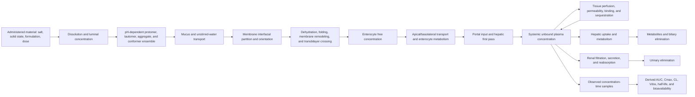

# PK process map for large molecules

## Objective and modeling stance

The immediate objective is to predict and explain large-molecule pharmacokinetics by representing the physical and biological states that generate an exposure profile. AUC, Cmax, clearance, half-life, bioavailability, and a single permeability value are downstream summaries. They are not interchangeable causes.

The program should maintain two models in parallel:

1. **a strong conventional baseline** using validated 2D/3D descriptors, fingerprints, graph models, and standard hybrid PK models; and
2. **a process-resolved model** whose intermediate variables correspond to speciation, conformational selection, phase transfer, transport, metabolism, distribution, and elimination.

The physics model is allowed to be more complex without immediately improving headline error. It earns scientific value by explaining perturbations, localizing failure, maintaining mass balance, and transferring across chemical series and assay conditions. Complexity without identifiability, sensitivity analysis, or falsifiable consequences is not useful.

## Causal process graph

For intravenous data, the graph begins at systemic input and can identify distribution and elimination but says almost nothing about oral absorption. For oral data, absolute bioavailability is the product of several distinguishable factors, commonly summarized as fraction absorbed, fraction escaping gut metabolism, and fraction escaping hepatic first pass. Each factor can be low for a different reason and requires different chemical changes.

## State-by-state decomposition

### 0. Chemical identity and administered state

Record exact stereochemistry, isotopes where relevant, salt/counterion, solvate, solid form, formulation, dose, route, vehicle, and concentration. Large molecules can aggregate or precipitate in a formulation even when a calculated monomer structure looks favorable. A parent structure without administered-state metadata is not a complete PK input.

Key observations: thermodynamic and kinetic solubility, dissolution curve, particle size, supersaturation lifetime, precipitation, formulation composition.

### 1. Solution speciation and association

Enumerate protomers, tautomers, stereochemical states, metal complexes, and plausible aggregates as functions of pH, ionic strength, and concentration. Use microscopic rather than incorrectly assigned macroscopic pKa values when site-specific populations matter. Qi et al. show why: a roughly 0.14% neutral tautomer can dominate permeability because its crossing rate is six orders of magnitude higher than the dominant zwitterion.

State variables: population and uncertainty of each microstate; aggregation number; hydration free energy; charge distribution; population-exchange kinetics.

### 2. Environment-conditioned conformational ensemble

Large flexible molecules can present different shapes and polarity in water, at a membrane interface, within a low-dielectric core, or when bound to proteins. The model must not use one gas-phase or minimized conformer.

State variables by environment:

- conformer populations and transition rates;
- Rgyr, end-to-end distance, anisotropy, and principal moments;
- solvent-accessible 3D polar surface distribution;
- intramolecular hydrogen-bond network occupancy;
- solvent- and lipid-competing hydrogen bonds;
- exposed charge/polarity patches rather than only total PSA;
- conformational entropy and free-energy cost of adopting transport-competent states.

Poongavanam et al. support this layer in a three-PROTAC series, but the target is broader: predict the probability and formation cost of rare membrane-compatible conformations, not merely an average compactness score.

Price et al. 2024 and Schade et al. 2024 sharpen this requirement. ETR shows that
experimental polarity can differ from TPSA, but it does not identify whether the cause is
static shielding, dynamic IMHB formation, or another assay/environment effect. Schade et
al. observed useful site-specific donor shielding in clinical oral PROTACs that remained
globally extended in solution. Therefore, low Rg is not a required transport mechanism.
The primary variables are local donor/acceptor exposure, compensating contacts, and the
kinetic accessibility of a competent path; global compactness remains a diagnostic only.

### 3. Dissolution and pre-membrane transport

Dissolution sets the maximum monomer concentration available for absorption. Mucus binding, unstirred-water diffusion, and self-association can reduce flux before a membrane is encountered. The relevant input to membrane crossing is the local unbound microstate concentration, not nominal dose or bulk total concentration.

State variables: dissolution rate, free monomer activity, diffusion coefficient, mucus partition, aggregate/monomer exchange, local pH.

### 4. Membrane insertion and crossing

Separate at least four substeps:

1. water-to-headgroup partition;
2. orientation and conformational selection at the interface;
3. dehydration and movement through the hydrophobic core; and
4. rehydration/desorption into the receiving phase.

For each microstate and conformer pathway, estimate interfacial wells, barrier height and width, local diffusivity, hydration defects, lipid hydrogen bonds, membrane deformation, and hysteresis. Qi et al. demonstrate that membrane patch size itself can change an apparent barrier because small patches suppress deformation and very large patches make a global coordinate degenerate.

The state-specific permeability is a path integral of thermodynamic resistance and diffusivity. Effective permeability is a population- and kinetics-weighted combination across microstates. Both fast and slow protonation limits should be evaluated when transition rates are unknown.

### 5. Transporter and enterocyte competition

Caco-2 AB/BA values, efflux ratios, and passive reconstructions are protocol-conditioned observations. Explicitly represent passive flux, apical uptake, basolateral exit, efflux, intracellular binding, and enterocyte metabolism. Saturation and time dependence distinguish processes that a single apparent permeability conflates.

State variables: unbound intracellular concentration, transporter-specific Km/Vmax or low-concentration clearance, membrane sidedness, metabolic intrinsic clearance, cell accumulation, recovery.

The 2026 cross-portfolio study by Le Manach et al. did not reproduce a general ETR or
other chameleonicity relationship but found valid efflux ratios useful for excluding poorly
absorbed PROTACs. This makes transporter competition a mandatory rival explanation, not
an assay nuisance. For enterocyte state `s`, a simple competing-hazard approximation is

\[
P_{escape}(s)=\frac{k_{BL}(s)}{k_{BL}(s)+k_{efflux}(s)+k_{gut-met}(s)+k_{seq}(s)}.
\]

The full re-entry network should report systemic-escape probability,
metabolism-before-escape probability, expected apical efflux/re-entry cycles, and cumulative
intracellular residence time. Efflux ratio, recovery, and inhibitor response are observations
that constrain this network; they are not themselves universal molecular properties.

### 6. Hepatic first pass and systemic clearance

Decompose total hepatic extraction into blood flow, unbound fraction, sinusoidal uptake, enzyme-specific metabolism, biliary transport, and intracellular sequestration. Microsomal CLint alone omits renal clearance, uptake limitation, nonmicrosomal metabolism, transport, and blood-cell partition. Mavroudis et al. show the resulting signature: PBPK driven by microsomal CLint systematically overpredicts exposure when other clearance routes are absent.

State variables: fu in plasma and incubation, blood/plasma ratio, uptake clearance, unbound metabolic CLint, biliary clearance, organ flow, enzyme/transporter abundance, time-dependent inhibition or induction.

### 7. Distribution and tissue retention

Volume of distribution is an emergent summary of tissue partition, permeability limitation, binding, pH trapping, lysosomal sequestration, and blood flow. Large molecules may equilibrate slowly, so an equilibrium partition coefficient can be inadequate.

State variables: organ-specific unbound partition, permeability-surface-area product, association/dissociation with tissue components, subcellular sequestration, perfusion, and exchange rates.

### 8. Renal and other elimination

Separate filtration of unbound drug, active secretion, passive/active reabsorption, metabolism, and molecular-size restrictions. A total-clearance label cannot reveal which intervention will improve exposure.

### 9. Observation model

Map latent amounts and concentrations to matrix-specific measurements with sampling time, lower limit of quantification, extraction recovery, metabolite interference, animal covariates, and residual error. Fit raw concentration-time observations whenever available. CL, Vdss, AUC, Cmax, and half-life should be calculated posterior predictions and validation summaries.

## Feature hierarchy

### Tier 0: conventional controls

MW, cLogP/logD, HBD/HBA, tPSA, rotatable bonds, formal charge, fragments, fingerprints, graph embeddings, and standard learned ADME inputs. These establish how much is already captured by traditional correlations.

### Tier 1: low-cost mechanistic features

Microstate enumeration; microscopic-pKa uncertainty; conformer ensembles in water and low-polarity implicit environments; separate site-resolved donor/acceptor exposure; IMHB and steric-shielding hypotheses; shape/polarity joint states; simple dissolution, fu, efflux, recovery, and metabolism priors; typed assay context. Published ETR, eHBD/eHBA, EPSA, and AB-MPS values are comparators or experimental validators, not assumed causal features.

### Tier 2: explicit environment physics

Explicit-solvent conformer ensembles; membrane-interface sampling; local hydration and lipid interaction fields; multi-state permeability approximations; organ-specific mass-balance model; posterior uncertainty propagation.

### Tier 3: targeted high-cost calculations

Multidimensional PMFs, local diffusivity, enhanced sampling, constant-pH or microstate-transition calculations, membrane deformation coordinates, alchemical solvation/binding, and transporter or enzyme structure-based calculations. Apply to a small design panel chosen for information gain, not to every molecule indiscriminately.

## Determining the large-molecule regime

Do not declare 650, 700, or 750 Da a biological law. Treat molecular weight continuously and pre-report descriptive bands at those values. Search for reproducible regime changes only in training data and confirm them prospectively.

Candidate evidence for a mechanistic boundary includes:

- nonlinear increase in conformer count or transition time;
- emergence of multimodal exposed-polarity distributions;
- sharp change in the cost or probability of compact membrane-compatible states;
- increased membrane deformation or collective-variable failure;
- shift from perfusion- to permeability-limited tissue distribution;
- systematic assay missingness or censoring; and
- a stable change point in calibrated model residuals across multiple chemical series.

Use bootstrap confidence intervals and hierarchical/continuous interactions before fitting a discrete change point. A cutoff is credible only if it repeats across datasets or prospective measurements and improves physical interpretation, not merely one validation metric. With current sparse data, report uncertainty and keep the boundary provisional.

## Model architecture

Use a modular probabilistic program or differentiable ODE framework:

- each process has explicit inputs, states, conservation equations, and observation links;
- absent measurements create uncertain latent variables rather than silent default values;
- priors are informed by physics and literature but updated by assay data;
- assay/source effects are hierarchical;
- state and parameter uncertainty propagate to concentration-time and decision uncertainty;
- conventional ML can predict parameters, while equations constrain how parameters generate profiles.

Do not allow downstream observed outcomes to leak back as input features for the same profile. Fit all learned components, imputers, calibrators, and feature selection inside the training fold.

## Validation and causal diagnostics

### Metrics by layer

- Primitive assays: MAE, RMSE, signed bias, Spearman, calibration slope/intercept, censor-aware likelihood, interval coverage.
- Permeability: log-error, rank correlation within matched series, cross-membrane transfer, pH response, AB/BA/efflux consistency, flux mass balance.
- Concentration-time: weighted residual error on log concentration, time-resolved bias, prediction-interval coverage, terminal-slope error, mass-balance violation.
- Exposure summaries: AUC, Cmax, Tmax, half-life, MRT, CL, Vdss, and bioavailability fold error.
- Decision quality: Pareto ranking stability, probability of meeting a target profile, and calibration of abstention.

Report every metric by chemical series, route, species, assay, size band, charge/microstate complexity, flexibility, nearest-neighbor distance, and data completeness.

### Mechanistic tests

- **Ablation:** remove each process and test the residual signature, not only aggregate error.
- **Intervention:** predict pH, formulation, linker, transporter-inhibitor, protein-binding, membrane-composition, dose, and route changes.
- **Negative control:** require a feature to fail where its process should be irrelevant.
- **Conservation:** verify amount balance across compartments at every time step.
- **Sensitivity:** vary microscopic pKa, force field, conformer populations, membrane size, distribution model, and missing pathways.
- **Counterfactual consistency:** the same parameter change should have coherent consequences across permeability, tissue distribution, and exposure.

## Realistic work with limited data

Current data can support a transparent baseline, typed inventory, process-coverage matrix, uncertainty-aware descriptive analysis, and a small number of targeted physics case studies. It cannot identify every process for every molecule.

Use partial pooling and multi-fidelity evidence rather than discarding sparse endpoints. Preserve incomplete rows. Train only tasks with defensible sample size, but use unmodeled records to define missingness, chemical domain, and experiment priorities. Build the architecture now with explicit unknowns so future data can populate it without schema changes.

Highest-value additions are raw IV and oral profiles with matched formulation, species and assay metadata; fu and blood/plasma ratios; microsomal/hepatocyte clearance; solubility and dissolution; pH-dependent permeability with transporter controls; and matched large-molecule linker or polarity series.

## Eventual PK-hERG optimization

Do not collapse PK and hERG into one score during discovery of the mechanisms. Maintain a Pareto frontier over:

- probability of achieving the desired exposure profile;
- unbound concentration at the target site;
- hERG exposure margin and kinetic risk;
- solubility/formulation feasibility;
- uncertainty and applicability distance; and
- synthetic or experimental feasibility when later supplied.

Optimization should operate on actionable process variables. For example, a change that improves apparent permeability by increasing a persistent cationic hydrophobic state may worsen hERG access and binding. A chameleonic edit that reduces exposed polarity only in a membrane-like environment may improve PK without the same hERG penalty. Prefer candidates predicted to be robust across plausible parameter/model choices, and use active learning to select experiments that most reduce decision uncertainty.

## Immediate deliverables

1. Typed process/assay schema and process-coverage report for all existing PK rows.
2. Conventional baselines under nested scaffold, temporal, source-held-out, and large-molecule splits.
3. Tier-1 microstate and ensemble features with ablation and uncertainty.
4. One small matched-series conformational/permeability case study.
5. A modular IV disposition model fitted to raw curves when available.
6. A prospective data-acquisition plan targeting the currently unidentifiable processes.
7. A transporter-aware enterocyte fate model constrained by bidirectional permeability,
   recovery, and inhibitor controls, with ETR/chameleonicity retained as explicit competing
   hypotheses rather than assumed truths.

This sequence makes progress with sparse data while keeping the final architecture mechanistic and extensible.
